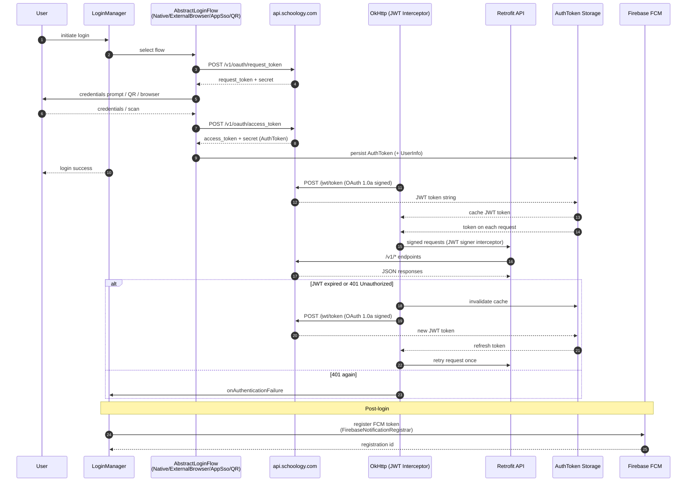
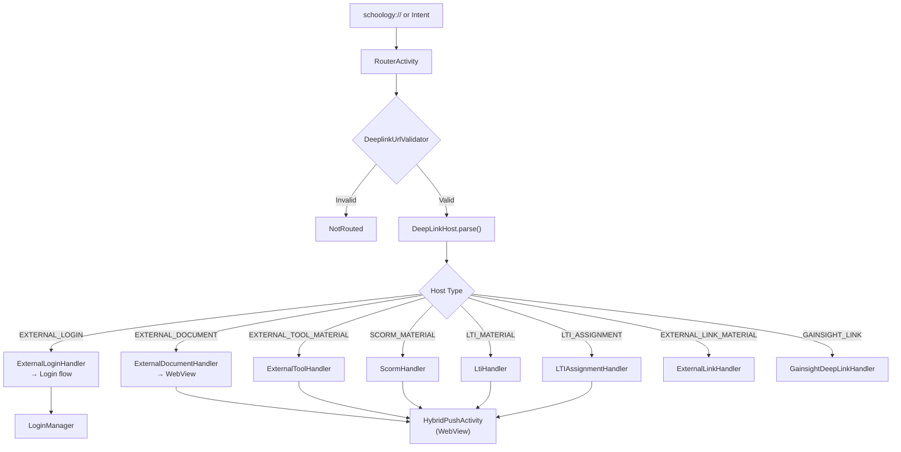

# SCHOOLYOGY_APK_REVERSE_ENGINEERING.md

> Generated from decompiled APK: `com.schoology.app` v2026.06.0 (code 600000477), 66MB

---

## 1. Application Overview

| Property | Value |
|----------|-------|
| Package | `com.schoology.app` |
| Version Name | `2026.06.0` |
| Version Code | `600000477` |
| Min SDK | 23 (Android 6.0) |
| Target SDK | 35 (Android 15) |
| Compile SDK | 34 (Android 14) |
| Application Class | `com.schoology.app.util.ApplicationUtil` (extends `Application`, renamed via ProGuard/R8) |
| Architecture | Hybrid: native Android UI + WebView/JS (assets/bundle.js, webpack-bundled) |
| Total Java Classes | ~9,416 (decompiled from 3 DEX files) |
| App Classes (proguard-runtime) | ~3,045 |
| DI Framework | Dagger 2 (`DaggerAppComponent`, `AppComponent`) |
| Networking | Retrofit + OkHttp |
| Auth | OAuth 1.0a token exchange → JWT Bearer tokens (`Authorization: Bearer <token>`) |
| Persistence | GreenDAO (generated entities in `com.schoology.app.dbgen`) |
| Image Loading | Glide (`GlideImageLoader`) |
| PDF Engine | PdfTron (`com.pdftron.pdf.utils.PDFTronToolsInitializer`) |
| Analytics | Gainsight PX (web JS bridge via `assets/bundle.js`) |
| Push Notifications | Firebase Cloud Messaging (`PushNotificationService`, `FirebaseMessagingService`) |
| Crash Reporting | Firebase Crashlytics |
| Sync Engine | IntentService-based (`SyncService`) with `SyncManager` + `DownloadJob` hierarchy |

---

## 2. Application Lifecycle

```
ApplicationUtil.onCreate()
├── AppComponent injection (Dagger)
│   ├── NetworkModule → OkHttpClient, Retrofit, ServerConfig
│   ├── JwtModule → JwtSignerInterceptor, JwtCache, JwtAuthenticator
│   └── RepositoryModule → all Repository instances
├── ServerConfig initialization (singleton via Companion)
│   └── SharedPreferences "A_CONF"
├── Notification channel creation (API 26+)
├── Analytics initialization (Gainsight PX)
└── Push notification registration (Firebase)
```

---

## 3. Permissions Declared (14)

### Standard Permissions
| Permission | Purpose |
|------------|---------|
| `INTERNET` | Network access |
| `ACCESS_NETWORK_STATE` | Check connectivity |
| `CAMERA` | QR code login, photo capture |
| `RECORD_AUDIO` | Video calls |
| `MODIFY_AUDIO_SETTINGS` | Audio routing |
| `VIBRATE` | Notifications |
| `WAKE_LOCK` | Keep CPU during sync |
| `FOREGROUND_SERVICE` | SyncService foreground |
| `POST_NOTIFICATIONS` | Android 13+ notification permission |

### Storage
| Permission | Purpose |
|------------|---------|
| `READ_EXTERNAL_STORAGE` | File/document access |

### Third-Party
| Permission | Source | Purpose |
|------------|--------|---------|
| `com.google.android.c2dm.permission.RECEIVE` | GCM/FCM | Push notifications |
| `com.google.android.finsky.permission.BIND_GET_INSTALL_REFERRER_SERVICE` | Google Play | Install referrer |

### Hardware Features (Required)
- `android.hardware.camera`
- `android.hardware.camera.autofocus`
- `android.hardware.camera.flash`
- `android.hardware.camera.front`
- `android.hardware.microphone`
- `android.hardware.screen.landscape`
- `android.hardware.wifi`

---

## 4. Core Components

### Activities (52)
| Activity | Purpose |
|----------|---------|
| `navigation.MenuActivity` | Main screen with SlidingMenu drawer |
| `navigation.startup.StartupActivity` | Splash screen + ParallelStartup |
| `deeplink.RouterActivity` | Deep link routing entry point |
| `ui.login.LoginNativeActivity` | Native login (email/password) |
| `ui.login.LoginExternalActivity` | External browser login |
| `ui.login.ExternalLoginSelectionActivity` | Choose login method |
| `ui.login.LoginOAuthManagementActivity` | OAuth account management |
| `ui.login.LoginSearchActivity` | School search |
| `ui.login.QRCodeCameraActivity` | QR code scanner |
| `ui.login.QRCodeLoadingActivity` | QR code processing |
| `ui.login.EnableCameraActivity` | Camera permission setup |
| `ui.login.appsso.SSOLoginActivity` | App SSO login |
| `dev.settings.DevSettingsActivity` | Developer settings |
| `hybrid.hybridpush.HybridPushActivity` | WebView hybrid screens |
| `storage.StorageActivity` | Offline storage management |
| `settings.AccountSettingsWebView` | Account settings (WebView) |
| `ui.SchoologyBaseActivity` | Base activity for all UI screens |
| `ui.courses.LTIWebView`, `SCORMWebView`, `WebPackagesWebView`, `AssessmentWebView`, `LTIAssignmentActivity` | Course content WebViews |
| `ui.album.gallery.GalleryActivity`, `MediaPagerActivity`, `addMedia.AddMediaActivity` | Photo/video albums |
| `ui.grades.TeacherStudentGradesActivity`, `FinalGradesActivity`, `RevisionSelectorActivity` | Grades screens |
| `ui.submissions.SubmissionActivity`, `SubmissionIoActivity` | Assignment submissions |
| `ui.messages.*` | Message composition/display |
| `ui.notifications.*` | Notifications |
| `ui.share.ShareActivity`, `ShareFromInsideActivity`, `NewShareActivity` | Sharing |
| `ui.groups.GroupPagerActivity` | Group detail |
| `ui.school.SchoolPagerActivity` | School detail |
| `ui.section.SectionProfileActivity` | Section detail |
| `ui.profile.old.ProfileActivity` | User profile |
| `ui.calendar.*` | Calendar |
| `ui.comments.CommentsActivity` | Comments |
| `ui.page.PageActivity` | Pages |
| `ui.requests.*` | Friend requests |
| `ui.resources.*` | Resources |
| `util.CameraPermissionsActivity` | Camera permission UI |

### Services (10)
| Service | Purpose |
|---------|---------|
| `com.schoology.app.sync.SyncService` | Data synchronization (IntentService) |
| `com.schoology.app.account.AuthenticatorService` | Account authentication |
| `com.schoology.app.pushnotification.PushNotificationService` | FCM message handling |
| `com.google.firebase.messaging.FirebaseMessagingService` | Firebase FCM |
| `com.google.firebase.components.ComponentDiscoveryService` | Firebase component discovery |
| `com.google.android.datatransport.runtime.scheduling.jobscheduling.JobInfoSchedulerService` | Firebase analytics transport |
| `com.google.android.gms.measurement.AppMeasurementService` | Google Analytics |
| `com.google.android.gms.measurement.AppMeasurementJobService` | Google Analytics (job) |
| `com.google.android.datatransport.runtime.backends.TransportBackendDiscovery` | Transport backend |
| `androidx.room.MultiInstanceInvalidationService` | Room multi-instance (unused, from dependency) |

### BroadcastReceivers (3)
| Receiver | Purpose |
|----------|---------|
| `com.google.firebase.iid.FirebaseInstanceIdReceiver` | FCM token refresh |
| `com.google.android.gms.measurement.AppMeasurementReceiver` | Analytics events |
| `com.google.android.datatransport.runtime.scheduling.jobscheduling.AlarmManagerSchedulerBroadcastReceiver` | Transport scheduling |

### ContentProviders (7)
| Provider | Purpose |
|----------|---------|
| `androidx.core.content.FileProvider` | File sharing |
| `com.pdftron.pdf.utils.PDFTronToolsInitializer` | PdfTron initialization |
| `com.pdftron.pdf.utils.ShareProvider` | PdfTron file sharing |
| `com.google.firebase.provider.FirebaseInitProvider` | Firebase init |
| `com.google.firebase.perf.provider.FirebasePerfProvider` | Firebase Performance |
| `com.squareup.picasso.PicassoProvider` | Picasso image caching |
| `androidx.lifecycle.ProcessLifecycleOwnerInitializer` | Lifecycle |

---

## 5. Authentication & Network Flow



---

## 6. Server Configuration

| Environment | Host | Source |
|------------|------|--------|
| LIVE | `schoology.com` | `SGYEnvironment.LIVE` |
| STAGING | `schoologystg.com` | `SGYEnvironment.STAGING` |
| SANDBOX | `schoologytest.com` | `SGYEnvironment.SANDBOX` |
| DEV | `qa-mobile.schoologydev.com` | `SGYEnvironment.DEV` |
| CANADIAN | `schoologyca.com` | `SGYEnvironment.CANADIAN` |
| LOCAL | `localenv.ninja` | `SGYEnvironment.LOCAL` |

All API base URLs are dynamically configurable via `ServerConfig` (SharedPreferences "A_CONF").

---

## 7. REST API Endpoints Reference

### Auth Endpoints
| Method | Path | Purpose |
|--------|------|---------|
| POST | `/v1/oauth/request_token` | OAuth request token |
| POST | `/v1/oauth/access_token` | OAuth access token |
| POST | `/jwt/token` | JWT token (OAuth-signed) |
| GET | `/login/school_lookup` | School lookup |
| GET | `/login/school_search` | School search |

### Core API Endpoints (from decompiled `endpoints/*.java`)

#### Users
| Method | Path | Purpose |
|--------|------|---------|
| GET | `/users/me` | Current user info |
| GET | `/users/{user_id}` | User profile |
| GET | `/users/{user_id}/grades` | User grades |
| GET | `/users/{user_id}/groups` | User groups |
| GET | `/users/{user_id}/sections` | User sections |
| GET | `/users/{user_id}/requests/friends` | Friend requests |
| GET | `/users/{user_id}/requests/friends/{request_id}` | Friend request detail |
| GET | `/users/{user_id}/invites/{realm}` | Invites |
| GET | `/users/{user_id}/invites/{realm}/{invite_id}` | Invite detail |

#### Schools
| Method | Path | Purpose |
|--------|------|---------|
| GET | `/schools` | List schools |
| GET | `/schools/{school_id}` | School detail |
| GET | `/schools/{school_id}/buildings` | School buildings |

#### Courses
| Method | Path | Purpose |
|--------|------|---------|
| GET | `/courses/{course_id}` | Course detail |
| GET | `/courses/{course_id}/folder` | Course folder |
| GET | `/courses/{course_id}/folder/{folder_id}` | Folder contents |
| GET | `/courses/{course_id}/metadata` | Course metadata |

#### Groups (Realms)
| Method | Path | Purpose |
|--------|------|---------|
| GET | `/groups` | List groups |
| GET | `/groups/{group_id}` | Group detail |
| GET | `/groups/{group_id}/albums` | Group albums |
| GET | `/groups/{group_id}/albums/{album_id}` | Album detail |
| GET | `/groups/{group_id}/albums/{album_id}/content` | Album content |
| GET | `/groups/{group_id}/discussions` | Group discussions |
| GET | `/groups/{group_id}/discussions/{discussion_id}` | Discussion detail |
| GET | `/groups/{group_id}/documents` | Group documents |
| GET | `/groups/{group_id}/documents/{doc_id}` | Document detail |
| GET | `/groups/{group_id}/events` | Group events |
| GET | `/groups/{group_id}/pages` | Group pages |
| GET | `/groups/{group_id}/pages/{page_id}` | Page detail |

#### Sections
| Method | Path | Purpose |
|--------|------|---------|
| GET | `/sections` | List sections |
| GET | `/sections/{section_id}` | Section detail |
| GET | `/sections/{section_id}/assignments` | Assignments |
| GET | `/sections/{section_id}/assignments/{assign_id}` | Assignment detail |
| GET | `/sections/{section_id}/submissions` | Submissions |
| GET | `/sections/{section_id}/submissions/{sub_id}` | Submission |
| GET | `/sections/{section_id}/submissions/{sub_id}/{user_id}` | User submission |
| GET | `/sections/{section_id}/submissions/{sub_id}/{user_id}/revision/{rev_id}` | Revision |
| GET | `/sections/{section_id}/grades` | Grades |
| GET | `/sections/{section_id}/grading_scales` | Grading scales |
| GET | `/sections/{section_id}/materials_hierarchy` | Materials hierarchy |
| GET | `/sections/{section_id}/folders` | Folders |
| GET | `/sections/{section_id}/enrollments` | Enrollments |
| GET | `/sections/{section_id}/attendance` | Attendance |
| GET | `/sections/accesscode` | Section access code |

#### Messages
| Method | Path | Purpose |
|--------|------|---------|
| GET | `/messages` | Messages list |
| GET | `/messages/{message_id}` | Message detail |
| GET | `/messages/recipients` | Recipients |
| GET | `/messages/inbox` | Inbox |
| GET | `/messages/inbox/{message_id}` | Inbox message |
| GET | `/messages/sent` | Sent |
| GET | `/messages/sent/{message_id}` | Sent message |

#### Files
| Method | Path | Purpose |
|--------|------|---------|
| GET/POST | `/file` | File operations |
| GET | `/files` | Files list |
| GET | `/files/{file_id}` | File detail |
| GET | `/files/{file_id}/annotations` | Annotations |
| GET | `/annotations/{file_id}` | Annotations (alias) |
| GET | `/upload` | Upload init |
| GET | `/upload/{upload_id}` | Upload status |

#### Mobile-Specific
| Method | Path | Purpose |
|--------|------|---------|
| GET | `/mobile` | Mobile config |
| GET | `/mobile/me` | Mobile user profile |
| GET | `/mobile/enabled_features` | Feature flags |
| GET | `/mobile/notifications` | Mobile notifications |
| GET | `/notifications` | Notifications |
| GET | `/notifications/read` | Mark read |

#### Misc
| Method | Path | Purpose |
|--------|------|---------|
| GET | `/oauth/timestamp` | OAuth timestamp |
| GET | `/multiget` | Multi-get batch |
| GET | `/multioptions` | Multi-options |
| GET | `/{path}` | Dynamic path |

### Sync/Download Endpoints (from `SyncManager` + `DownloadJob`)
| Job | Endpoint Pattern | Purpose |
|-----|-----------------|---------|
| `AssignmentsDownloadJob` | `/sections/{section_id}/assignments` | Sync assignments |
| `DiscussionsDownloadJob` | `/groups/{group_id}/discussions` | Sync discussions |
| `DocumentsDownloadJob` | `/groups/{group_id}/documents` | Sync documents |
| `PagesDownloadJob` | `/groups/{group_id}/pages` | Sync pages |
| `AlbumsDownloadJob` | `/groups/{group_id}/albums` | Sync albums |
| `FoldersDownloadJob` | `/courses/{course_id}/folder` | Sync folders |

### Assignment Submission API
```
POST /section/{sectionId}/assignment/{assignmentId}/submission
    → Create assignment submission (body: CreateAssignmentSubmissionBody)
GET /sections/{sectionId}/submissions/{submissionId}/{userId}
    → Get all revisions (with annotations, attachments options)
GET /sections/{sectionId}/submissions/{submissionId}/{userId}/revision/{revisionId}
    → Get specific revision
```

---

## 8. Deep Link Routing

All deep links route through `RouterActivity` → `DeepLinkHost` (enum) → Handler:



---

## 9. Data Persistence (GreenDAO Entities)

### Core Entities
| Entity | Source | Purpose |
|--------|--------|---------|
| `UserEntity` | `dbgen` | Current user, all profile fields |
| `SchoolEntity` | `dbgen` | Schools list |
| `SectionEntity` | `dbgen` | Sections/courses |
| `AssignmentEntity` | `dbgen` | Assignments |
| `DiscussionEntity` | `dbgen` | Discussion topics |
| `PageEntity` | `dbgen` | Pages |
| `FolderEntity` | `dbgen` | Folders |
| `DocumentEntity` | `dbgen` | Documents |
| `VideoEntity` | `dbgen` | Videos |
| `EmbedEntity` | `dbgen` | Embedded content |
| `LinkEntity` | `dbgen` | Links |
| `InAppNotifsEntity` | `dbgen` | In-app notifications |
| `CompletionRuleSyncEntity` | `dbgen` | Completion rules sync state |
| `AttachmentsEntity` | `dbgen` | Attachment metadata |

### DAOs (auto-generated by GreenDAO)
Each entity has a corresponding `*Dao` class for database operations:
- `*EntityDao` (CRUD operations)
- `DaoSession` (session manager)
- `DaoMaster` (database holder)

### Sync Persistence
| File | Purpose |
|------|---------|
| `SyncConfig` | Sync configuration (section IDs, flags) |
| `SyncProgress` | Progress tracking |
| `SyncManager` | Orchestration (singleton) |
| `DownloadQueue` | Download queue management |
| `DownloadJob` (abstract) | Base class for all download jobs |
| `OfflineInfoTransactionHandler` | Offline state management |
| `OfflineHash` | Content hash tracking for offline |
| `OfflineStatus` | Offline status enum |
| `OfflineContentDisposer` | Content cleanup |

---

## 10. Dagger Dependency Injection

```
DaggerAppComponent (AppComponent)
├── NetworkModule
│   ├── ServerConfig (singleton)
│   ├── OkHttpClient (OkHttpFactory)
│   ├── Retrofit (RestAdapterFactory.v1RestAdapter)
│   ├── Credential (CredentialFactory)
│   └── ImageLoader (GlideImageLoader)
├── JwtModule
│   ├── JwtSignerInterceptor
│   ├── JwtCache
│   ├── JwtAuthenticator
│   ├── JwtAuthenticatorApi (@GET /jwt/token)
│   ├── JwtProgressiveBackoffInterceptor
│   └── JwtAuthenticationFailureHandler
├── RepositoryModule
│   └── All Repository instances
└── ApplicationContextModule
    └── Application context
```

---

## 11. UI Architecture

```
ApplicationUtil (Application)
└── AppComponent (Dagger)
    └── Injected into:
        ├── Activities (via ActivityComponent/FragmentComponent)
        │   ├── MenuActivity (main, SlidingMenu drawer)
        │   ├── StartupActivity (splash)
        │   ├── RouterActivity (deep links)
        │   ├── HybridPushActivity (WebView)
        │   ├── Login activities
        │   └── All feature activities
        ├── Fragments
        │   └── SlidingMenuSectionFragment (drawer items)
        └── ViewModels
            ├── SectionNavViewModel (navigation state)
            └── Per-feature ViewModels
```

### Hybrid Architecture (WebView)
```
assets/bundle.js (webpack bundle, 36KB)
├── GainsightPX SDK (analytics)
├── JS Bridge: window.gpxjs.postMessage(JSON.stringify(body))
│   → Android: tsWindow.gpxjs.postMessage()
│   → iOS: window.webkit.messageHandlers.gpxjs.postMessage()
└── Platform detection (iOS vs Android)

HybridPushActivity → WebView → loads hybrid screens
└── JSBridge for native ↔ web communication
```

### Sync Architecture
```
SyncManager (singleton)
├── SyncService (IntentService, foreground)
├── DownloadQueue
│   ├── AssignmentsDownloadJob
│   ├── DiscussionsDownloadJob
│   ├── DocumentsDownloadJob
│   ├── PagesDownloadJob
│   ├── AlbumsDownloadJob
│   └── FoldersDownloadJob
├── StorageBroadcastReceiver (SD card mount/unmount)
└── SyncBroadcastManager (progress updates)
```

---

## 12. Third-Party Integrations

| Service | Integration | Purpose |
|---------|------------|---------|
| Firebase | Crashlytics, Analytics, FCM, Perf | Crash reporting, analytics, push, performance |
| Gainsight PX | `assets/bundle.js` + native bridge | Product analytics |
| PdfTron | `com.pdftron.pdf.utils.*` | PDF rendering |
| Google Play Install Referrer | `com.google.android.finsky` | Attribution |
| Glide | Image loading | Image caching |
| Picasso | `PicassoProvider` | Image provider |
| OAuth 1.0a | Server-side Schoology OAuth | API authentication |
| JWT | `POST /jwt/token` | API authorization |

---

## 13. Security Findings

### Hardcoded Credentials
- Google API key found in resources (removed from published documentation)

### Authentication
- OAuth 1.0a consumer key/secret in native code (no certificate pinning observed)

---
## 14. Burp Capture Findings (Parent Portal & PowerSchool - 2026-09-18)

Burp Suite confirmed the following runtime behaviors not visible in static analysis:

### Parent Portal Authentication & Session Architecture
- **Two active sessions**: `SESS` cookie (web portal, parent UI) + `s_mobile` cookie (mobile API) + FCM token
- Parent portal accessed via `/parent/*` routes requiring `SESS` cookie
- AJAX requests require `X-Csrf-Token` and `X-Csrf-Key` headers

### Confirmed Parent Portal Endpoints
| Endpoint | Method | Status | Purpose |
|----------|--------|--------|---------|
| `/parent` | GET | 302 → `/parent/home` | Entry point |
| `/parent/home` | GET | 200 HTML | Parent dashboard (PowerSchool assets) |
| `/iapi/parent/info` | GET | 200 JSON | Parent session info: `view_mode=1`, `view_child=<uid>`, child profiles |
| `/home/feed?page=0&children=<uid>` | GET | 200 JSON | Submission notifications per child |
| `/iapi/parent/overdue_submissions/<child_uid>` | GET | 200 JSON | Overdue assignments with course context |
| `/course/<course_id>/preview/<child_uid>/parent` | GET | 200 HTML | Parent view of course |
| `/parent/grades_attendance/grades` | GET | 200 HTML | Grades/attendance parent view |

### PowerSchool Integration
- **Embedded assets**: `assets.powerschool.com/neon/2.6.1` (UI components) + `assets.powerschool.com/pds/31.0.0` (design system + app switcher)
- Integration occurs in parent portal HTML (no separate PowerSchool APK)
- App switcher links to PowerSchool PDS (`docs.powerschool.com`)
- PowerSchool data served through Schoology parent API (`/iapi/parent/*`)

### File Download Flow
- Request: `app.schoology.com/system/files/attachments/...`
- Response: `302 Found` → `Location: signed CloudFront URL on files-cdn.schoology.com`
- URLs include expiration and signature parameters

### Multi-Option/Batch Endpoints (mobile API)
- `/v1/multioptions` (POST): Returns actual HTTP method per endpoint (e.g., `/v1/users/{uid}/grades` → GET/PUT)
- `/v1/multiget` (POST): Batch fetch of user/school data
- Reveals additional endpoints: `/v1/users/{uid}/grades`, `/v1/users/{uid}/assignments`, `/v1/users/{uid}/discussions`, `/v1/users/{uid}/events`

### What Burp Revealed That Static Analysis Could Not
1. Parent portal endpoint structure (`/parent/*`, `/iapi/parent/*`) — not in smali routing
2. PowerSchool integration (Neon 2.6.1 + PDS 31.0.0) — embedded in HTML only
3. Batch/multioptions usage — reveals actual HTTP methods per endpoint
4. Parent-specific data model — `view_mode`, `view_child`, `recent_counts`
5. Two-session architecture — `SESS` + `s_mobile` + FCM token coexistence
6. CSRF token handling — `X-Csrf-Token` / `X-Csrf-Key` headers
7. Empty sections/groups for parent role — parent sees only child data
8. File attachment signed-URL flow — CloudFront + query-string signing

---
- JWT tokens stored in persistent storage
- No certificate pinning detected in OkHttpClient configuration

### Deep Linking
- `deeplink.*` package handles all deep link routing
- No authentication required for deep link opening (login required for content access)

---

## 14. Third-Party Libraries (from manifest)

Key dependencies identified:
- AndroidX (AppCompat, Room, Lifecycle, DrawerLayout, SlidingPanelayout, CoordinatorLayout, SwipeRefreshLayout, VectorDrawable)
- Firebase (Crashlytics, Analytics, FCM, Installations, Config, Perf)
- Google Play Services (Auth, Measurement, Maps)
- OkHttp, Retrofit
- RxJava/RxAndroid (reactive programming)
- Glide (images)
- Picasso (images)
- GreenDAO (persistence)
- PdfTron (PDF)
- Gainsight SDK (analytics)
- QR Code scanning (ZXing via `journeyapps.barcodescanner`)

---

## 15. Directory Structure (Decompiled)

```
com/schoology/app/
├── account/           Login, Auth, UserManager, FeaturesManager
├── api/               ServerConfig, SGYEnvironment, OkHttpFactory, CacheFactory
├── dbgen/             GreenDAO entities + Daos (17+ entities)
├── dataaccess/
│   ├── datamodels/    AssignmentData, UserData, SectionData, etc.
│   └── repository/    AssignmentRepository, UserRepository, etc. (per feature)
├── di/                Dagger components/modules
│   ├── app/           AppComponent, NetworkModule, JwtModule, RepositoryModule
│   ├── activity/      Activity-scoped components
│   └── activity/fragment/ Fragment-scoped components
├── deeplink/          Deep link routing
│   ├── handler/       DeepLinkHost + all handlers
│   └── RouterActivity
├── hybrid/            WebView hybrid screens
│   ├── hybridpush/    HybridPushActivity
│   ├── websession/    Web session management
│   ├── webview/       WebView wrappers
│   ├── renderer/      Content renderers
│   └── analytics/     Hybrid analytics
├── navigation/        MenuActivity, SlidingMenu, StartupActivity
├── sync/              SyncService, SyncManager, DownloadJob hierarchy
├── pushnotification/  PushNotificationService, FCM registration
├── persistence/       CacheManager, DbHelper
├── logging/           CrashLogManager, Gainsight integration
├── domainmodel/       DomainModels (Assignment, User, Section, etc.)
├── ui/                All UI screens (50+ activities)
├── restapi/           API interfaces + models (Retrofit services)
│   ├── assignment/    AssignmentApi
│   ├── auth/          Credential, OAuth types
│   ├── fileService/   FileServiceApi
│   ├── model/         Request/Response models
│   └── services/
│       ├── endpoints/ SCHOOL, USER, COURSE, GROUP, SECTION, MISC, PLACEHOLDERS
│       └── jwt/       JwtAuthenticatorApi, JwtSignerInterceptor, JwtCache
├── dev/               Developer settings
├── settings/          App settings
├── storage/           Offline storage management
└── util/              Utilities, Rx helpers, formatters, file helpers
```

---

## 16. Key Build/Environment Config

| Item | Value |
|------|-------|
| Build Config | `BuildConfig` (auto-generated) |
| API URL | Dynamic via `ServerConfig` (SharedPreferences "A_CONF") |
| Firebase Config | `google-services.json` (api-key: AIzaSy...) |
| OAuth Consumer | In-app (no external config needed) |
| Web Bundle | `assets/bundle.js` (webpack, ~37KB) |
| ProGuard/R8 | Enabled (all class names obfuscated) |
| DEX Files | 3 (classes.dex, classes2.dex, classes3.dex) |

---

## 17. Summary of Reusable Patterns

To build a feature-complete clone, the following patterns should be replicated:

1. **Dagger AppComponent** → NetworkModule + JwtModule + RepositoryModule
2. **Retrofit + OkHttp** → RestAdapterFactory.v1RestAdapter with OAuth 1.0a signing interceptor
3. **JwtSignerInterceptor** → Bearer token injection, auto-refresh, retry on 401
4. **GreenDAO** → Code-generated entities + Daos
5. **SyncService (IntentService)** → SyncManager + DownloadJob hierarchy
6. **RouterActivity** → DeepLinkHost enum → handler pattern
7. **HybridPushActivity** → WebView with JS bridge
8. **MenuActivity** → SlidingMenu drawer with native + hybrid fragments

---

## 18. Files Generated

| File | Description |
|------|-------------|
| `SCHOOLYOGY_APK_REVERSE_ENGINEERING.md` | This report |
| `mermaid-diagrams.md` | Standalone mermaid diagrams |
| `manifest_clean.json` | Parsed manifest |
| `network_analysis.md` | Network findings |
| `ui_analysis.md` | UI analysis |
| `extracted/` | Raw extracted APK |
| `decompiled_java/` | JADX decompiled Java sources (obfuscated) |
| `apk/schoology.apk` | Original APK (66MB) |
