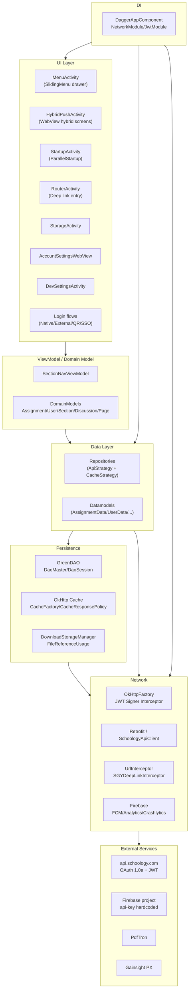
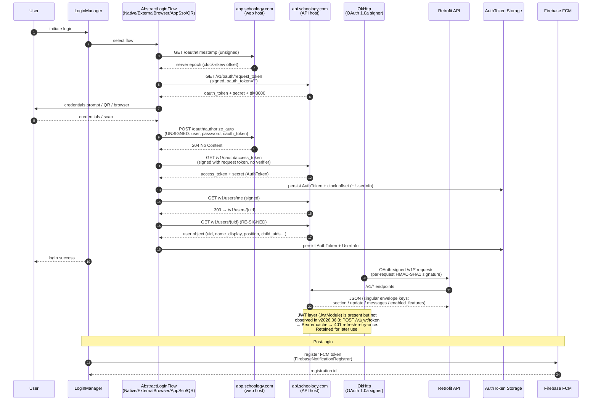
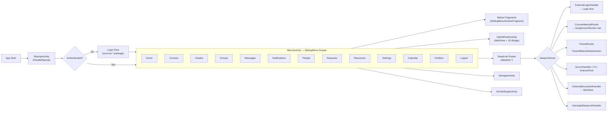
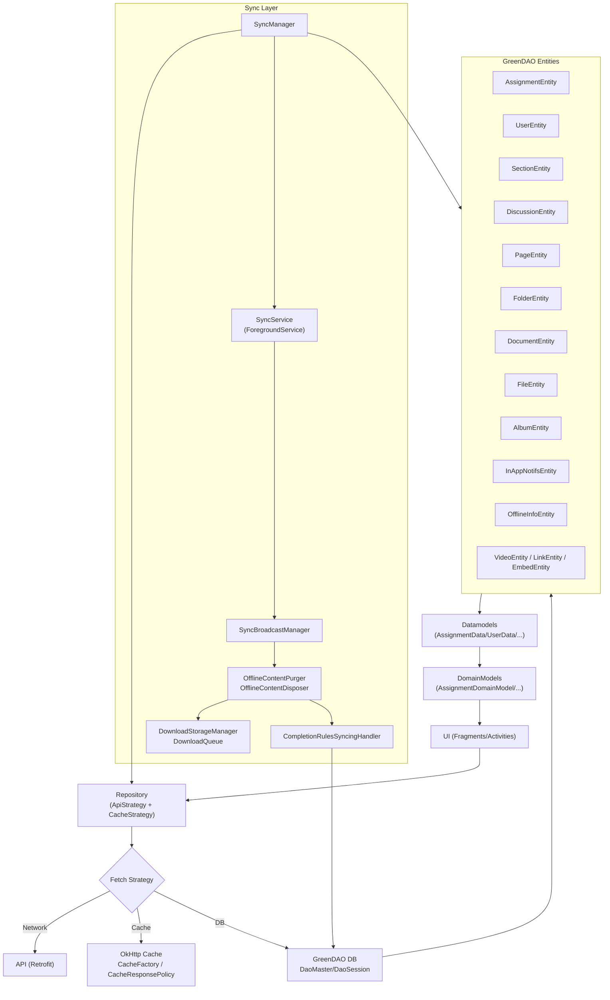
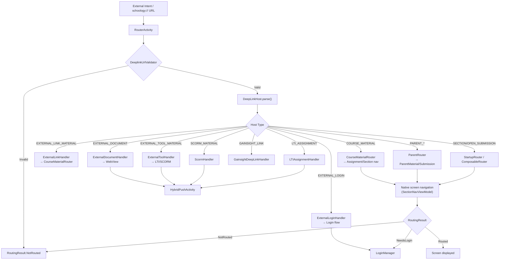

# Mermaid Diagrams - Schoology APK Reverse Engineering

> Based on decompiled sources from `com.schoology.app` v2026.06.0

## 1. System Architecture

## 2. Authentication & Network Flow

> **Wire-verified 2026-09-22** from a debuggable v2026.06.0 runtime login through Burp.
> Corrects the earlier decompilation-derived assumptions: token requests are GET (not
> POST), credentials are bound via an unsigned web-host endpoint, and the runtime signs
> every API request with OAuth 1.0a. The JWT layer (JwtModule) remains in the app but was
> not exercised in this flow — retained here for later use.

## 3. UI / Navigation Flow

## 4. Data Persistence & Sync Flow

## 5. Key Class / Package Relationships

```mermaid
flowchart TB
    subgraph App["com.schoology.app"]
        subgraph Account["account"]
            LM["LoginManager"]
            LF["AbstractLoginFlow<br/>Native/External/AppSso/QR"]
            Auth["AuthToken / AuthStorageWriter"]
            UM["UserManager"]
        end

        subgraph Api["api"]
            Env["SGYEnvironment<br/>LIVE/STAGING/DEV/SANDBOX/CANADIAN"]
            Ok["OkHttpFactory<br/>JWT Signer Interceptor"]
            Cache["CacheFactory<br/>CacheResponsePolicy/InvalidateCache"]
        end

        subgraph Data["dataaccess"]
            subgraph Repo["repository"]
                R1["AssignmentRepository<br/>DiscussionRepository"]
                R2["UserRepository / SchoolRepository"]
                R3["Messages / Notifications / Grades"]
                R4["File / Folder / Page / Document"]
            end
            subgraph DM["datamodels"]
                M1["AssignmentData / UserData"]
                M2["SectionData / SchoolData"]
                M3["FolderItemData / PageData"]
            end
        end

        subgraph DB["dbgen"]
            G["GreenDAO Entities + Daos<br/>DaoMaster / DaoSession"]
        end

        subgraph DI["di"]
            D1["DaggerAppComponent"]
            D2["NetworkModule / JwtModule"]
            D3["RepositoryModule / LoginModule"]
        end

        subgraph Hybrid["hybrid"]
            H1["HybridPushActivity"]
            H2["HybridPresenter / HybridViewModel"]
            H3["HybridInteractor / JSBridge"]
            H4["HybridWebSession / Renderers"]
        end

        subgraph Nav["navigation"]
            N1["MenuActivity / SlidingMenu"]
            N2["SlidingMenuFragment<br/>SlidingMenuSectionFragment"]
            N3["StartupActivity / ParallelStartup"]
        end

        subgraph DL["deeplink"]
            DL1["RouterActivity / DeepLinkHost"]
            DL2["Handlers (ExternalLogin/CourseMaterial/Parent)"]
            DL3["RouterModule (Dagger)"]
        end

        subgraph Other["..."]
            O1["pushnotification (FCM)"]
            O2["logging (Analytics/Gainsight)"]
            O3["imageloader (Glide/SVG)"]
            O4["sync (SyncManager/SyncService)"]
            O5["persistence (CacheManager/DbHelper)"]
        end
    end

    Account --> Api
    Account --> DI
    Api --> Data
    Data --> DB
    Data --> Hybrid
    DI --> Account
    DI --> Data
    DI --> Api
    DI --> Hybrid
    Nav --> Hybrid
    Nav --> DL
    DL --> Account
    DL --> Data
    Other --> Data
    Other --> DB
```

## 6. Deep Link Routing Flow

